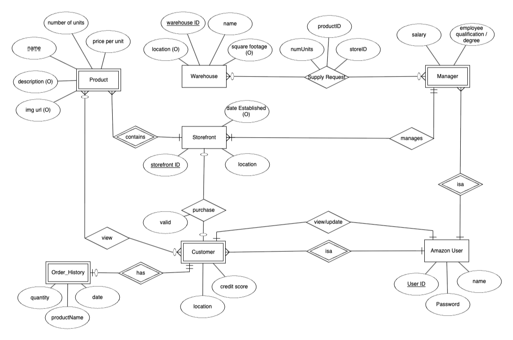

Amazon-Warehouse is a course project for a DBMS class where integrate SQL with Java to create a functioning Amazon website simulation.

Authors: Harrison Cooper and Joseph Chang. 

ER Diagram of the database

